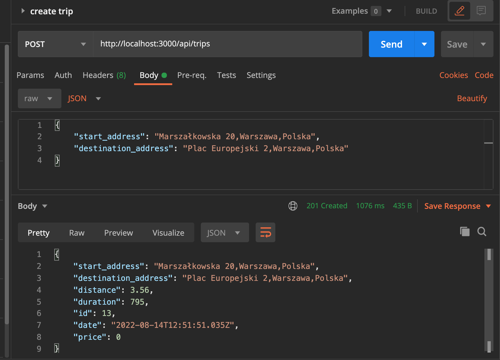
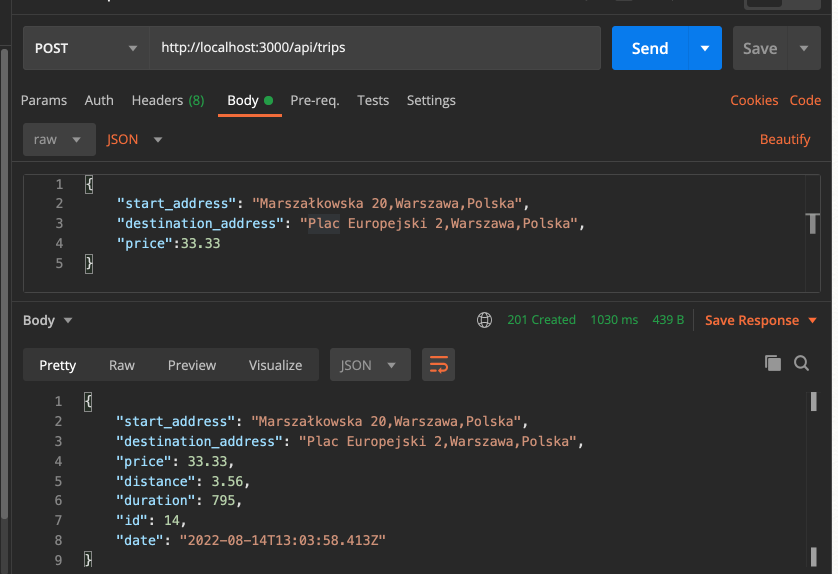
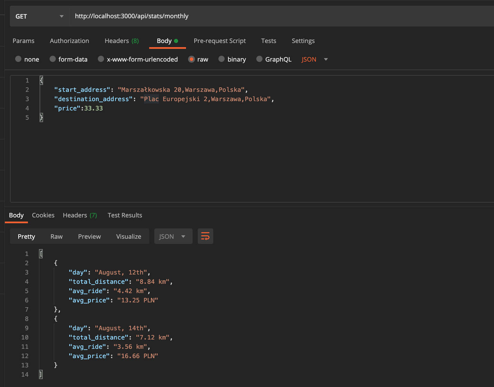
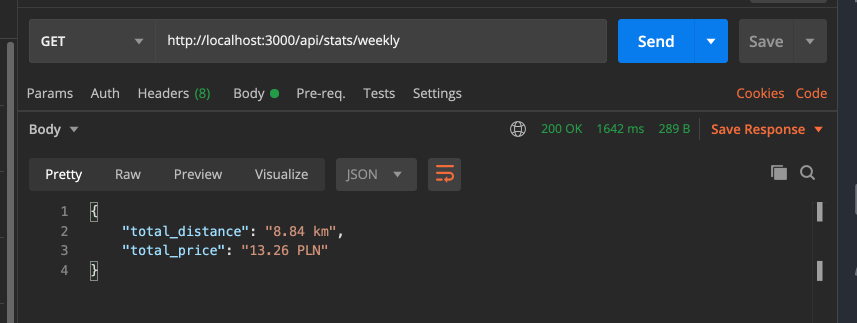

# About the project #
********************************

`bikeramp` is a system that will help couriers track their ride during delivery of packages: how many kilometers did they ride on each day and how much did the customer pay for delivery. The app will help control courier work.

## Create trip ##
***
This endpoint logs the trip and automatically calculates the distance between start and destination addresses.

### HTTP Request : `POST http://example.com/api/trips`

### Parameters:

**start_address** : Start address in format: "Plac Europejski 2, Warszawa, Polska", 
**destination_address** : Start address in format: "Plac Europejski 2, Warszawa, Polska",  
**price** : Package price in PLN, 
**date** : Date of delivery.

### Screenshots

1. Without specifying the price.

2. Without specifying the price.

## Stats ##
***
## Get Weekly Stats
This endpoint retrieves how many kilometers did the courier ride during current week and how much money he received for the rides.

### HTTP Request : `GET http://example.com/api/stats/weekly`

### Screenshots

## Get Monthly Stats
This endpoint retrieves a summary of ride distances from current month, grouped by day. The
summary should include sum of all rides distances from given day, average
ride distance and average price for the ride.

### HTTP Request : `GET http://example.com/api/stats/monthly`

### Screenshots

### How to run it

**O.Prerequisite**

In order to run the application you need to have installed:

- Node.js v18.7.0
- Postgres v 14.4

### Run bikeramp ###

`npm run start:dev`

## Attachments
***
- https://momentjs.com/
- https://lodash.com/
- https://distancematrix.ai/
- https://nestjs.com/
- https://positionstack.com/

